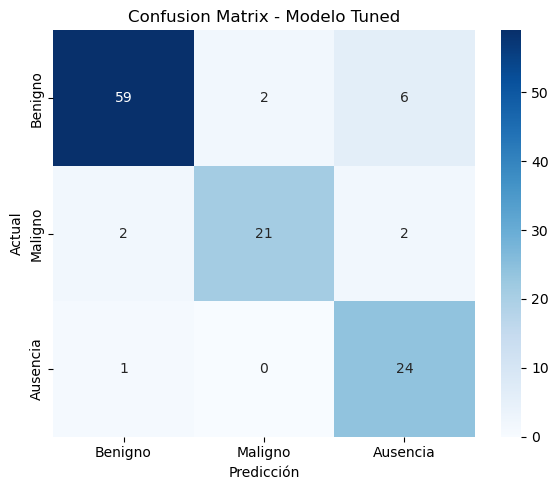

```{r setup, include=FALSE}
library(flexdashboard)
library(tidyverse)
library(plotly)
library(DT)
```

# Conjunto de Datos

## Descripción General

### Descripción General

El dataset utilizado en este proyecto proviene de la plataforma *Hugging Face:*  [`gymprathap/Breast-Cancer-Ultrasound-Images-Dataset`](https://huggingface.co/datasets/gymprathap/Breast-Cancer-Ultrasound-Images-Dataset)

Este conjunto de datos contiene imágenes de ultrasonido de tejido mamario, categorizadas en tres clases: **benign**, **malignant** y **normal**, que corresponden a presencia de tumor mamario benigno, presencia de tumor mamario maligno o cancerígeno y ausencia de tumor.

Originalmente, el dataset incluía también **máscaras binarias** asociadas a cada imagen (útiles para tareas de segmentación), pero estas fueron descartadas en este proyecto al centrarnos exclusivamente en la **clasificación de imágenes**.

El dataset está formado por **780 imágenes** en formato `PNG` provenientes de mujeres de entre 25 y 75 años. Para los procesos de entrenamiento y validación se dividió el dataset en 85% y 15%, respectivamente. Además, para el proceso de entrenamiento se manipularon las imágenes, reescalandolas todas a un tamaño común y aplicando **Data Augmentation** para introducir variabilidad y evitar *overfitting*.

## Imágenes

### Distribución de Clases

```{r class-distribution, echo=FALSE, message=FALSE, warning=FALSE}

path <- "data/multiclassDataset"

image_files <- list.files(path, recursive = TRUE, full.names = TRUE)

df <- data.frame(
  path = image_files,
  label = basename(dirname(image_files)) 
) |> 
  mutate(label = recode(label,
                        "0_benign" = "Benigno",
                        "1_malignant" = "Maligno",
                        "2_normal" = "Normal"))

df$label <- as.factor(df$label)

class_counts <- df |>
  group_by(label) |>
  summarise(count = n()) |>
  ungroup() |>
  mutate(percentage = (count / sum(count)) * 100)

plot_ly(class_counts,
        x = ~label,
        y = ~count,
        type = 'bar',
        text = ~paste0(count, " (", round(percentage, 1), "%)"),
        textposition = 'auto',
        marker = list(color = c("#66c2a5", "#fc8d62", "#8da0cb"))) |>
  layout(xaxis = list(title = "Clase"),
         yaxis = list(title = "Número de Imágenes"),
         showlegend = FALSE)
```

### Ejemplos del Dataset

<style>
.image-gallery {
  display: flex; 
  flex-wrap: wrap; 
  justify-content: space-around;
  align-items: flex-start; 
  gap: 10px;
  padding: 10px;
  margin-top: 20px;s
}

.image-gallery figure {
  margin: 0; 
  text-align: center; 
  flex: 1 1 auto;
  width: 160px; 
  height: auto;
}

.image-gallery img {
  width: 160px;
  height: auto; 
  display: block;
  margin-bottom: 10px;
}

.image-gallery figcaption {
  font-size: 0.9em; 
  color: #555;
  padding: 5px; 
}
</style>

<div class="image-gallery">
  <figure>
    
    <figcaption>Label: benign (0)</figcaption>
  </figure>
  <figure>
    
    <figcaption>Label: malignant (1)</figcaption>
  </figure>
  <figure>
    
    <figcaption>Label: normal (2)</figcaption>
  </figure>
</div>


# Modelo 1 - Detección de Tumores {#modelo1}

## Objetivo del Modelo {data-width=400}

### Objetivo del Modelo

El primer modelo del proyecto tiene el objetivo de **detectar** la presencia de tumores en imágenes de ultrasonido de tejido mamario. Se trata de un **clasificador binario**. Para ello, el conjunto de datos se ha reestructurado en dos categorías: **Ausencia (0)**, que contiene las imágenes con label *normal (2)*, y **Presencia (1)**, que contiene aquellas tanto *benign (0)* como *malignant (1)*. La distribución de clases se puede ver en la pestaña **EDA**. Para la construcción del modelo clasificador se ha utilizado una **red convolucional** previamente entrenada (***transfer learning***) que ha sido posteriormente entrenada con nuestro dataset. Además, se han entrenado dos modelos de complejidad diferente. En el primero (**Modelo Base**) solo se han refinado los parámetros de la última capa de la red neuronal. En el segundo (**Modelo Tuned**) se han refinado todos los parámetros de la red. El proceso de entrenamiento de ambos modelos puede verse en la pestaña **Entrenamiento** y las métricas de evaluación, las matrices de confusión y la curva ROC en el resto.

## Pestañas {.tabset}

### EDA

```{r eda-model1, echo=FALSE, message=FALSE, warning=FALSE}

path <- "data/recognitionDataset"

image_files <- list.files(path, recursive = TRUE, full.names = TRUE)

df <- data.frame(
  path = image_files,
  label = basename(dirname(image_files)) 
) |> 
  mutate(label = recode(label,
                        "0_ausence" = "Ausencia",
                        "1_presence" = "Presencia"))

df$label <- as.factor(df$label)

class_counts <- df |>
  group_by(label) |>
  summarise(count = n()) |>
  ungroup() |>
  mutate(percentage = (count / sum(count)) * 100)

plot_ly(class_counts,
        x = ~label,
        y = ~count,
        type = 'bar',
        text = ~paste0(count, " (", round(percentage, 1), "%)"),
        textposition = 'auto',
        marker = list(color = c("#66c2a5", "#8da0cb"))) |>
  layout(xaxis = list(title = "Clase"),
         yaxis = list(title = "Número de Imágenes"),
         showlegend = FALSE)
```


### Entrenamiento

El *Train Loss* de los modelos tuvo la siguiente evolución durante los 5 *epochs*.

```{r training-model1, echo=FALSE, warning=FALSE, message=FALSE}
# Datos de la evolución del Loss durante el entrenamiento
data_base <- tibble(
  Epoch = 0:4,
  `Train Loss` = c(0.7041, 0.6475, 0.5938, 0.5560, 0.5355),
  Model = "Model Base"
)

data_tuned <- tibble(
  Epoch = 0:4,
  `Train Loss` = c(0.4252, 0.1907, 0.1288, 0.0757, 0.0660),
  Model = "Model Tuned"
)

data_combined <- bind_rows(data_base, data_tuned)

p <- plot_ly(data_combined, x = ~Epoch, y = ~`Train Loss`, color = ~Model, type = 'scatter', mode = 'lines+markers') |>
  layout(
    xaxis = list(title = "Epoch", tickmode = "linear", dtick = 1),
    yaxis = list(title = "Train Loss", zeroline = FALSE),
    hovermode = "x unified",
    margin = list(b = 100)
  ) |>
  config(displayModeBar = TRUE)

p
```


### Métricas de Evaluación - Tabla

```{r metrics_table-model1}
# Principales métricas de ambos modelos
metrics_df <- tibble(
  Métrica = c("Accuracy", "Precision", "Recall", "F1", "ROC_AUC"),
  `Model Base` = c(0.8376, 0.8692, 0.9490, 0.9073, 0.8566),
  `Model Tuned` = c(0.9402, 0.9789, 0.9490, 0.9637, 0.9876)
)

datatable(metrics_df,
          options = list(
            dom = 't', 
            paging = FALSE, 
            ordering = FALSE, 
            info = FALSE,
            columnDefs = list(list(className = 'dt-center', targets = '_all'))
          ),
          rownames = FALSE,
          class = 'compact cell-border stripe hover' 
) |>
  formatRound(columns = c("Model Base", "Model Tuned"), digits = 4) 
```
### Métricas de Evaluación - Barplot

```{r metrics_plot-model1, fig.width=10, fig.height=6}
# Principales métricas de ambos modelos
metrics_df_long <- tibble(
  Métrica = c("Accuracy", "Precision", "Recall", "F1", "ROC_AUC"),
  `Model Base` = c(0.8376, 0.8692, 0.9490, 0.9073, 0.8566),
  `Model Tuned` = c(0.9402, 0.9789, 0.9490, 0.9637, 0.9876)
) |>
  pivot_longer(
    cols = c(`Model Base`, `Model Tuned`),
    names_to = "Modelo",
    values_to = "Valor"
  )

p_metrics <- plot_ly(metrics_df_long,
                     x = ~Métrica,
                     y = ~Valor,
                     color = ~Modelo, 
                     type = 'bar',
                     text = ~round(Valor, 4), 
                     textposition = 'outside',
                     texttemplate = '%{text:.4f}'
                     ) |>
  layout(
    xaxis = list(title = "Métrica"),
    yaxis = list(title = "Valor", range = c(0, 1.05)), 
    barmode = 'group', 
    hovermode = "x unified",
    legend = list(
      x = 0.83,
      y = 0.2,
      bgcolor = "rgba(255, 255, 255, 0.7)",
      bordercolor = "#FFFFFF",
      borderwidth = 2,
      xanchor = "left",
      yanchor = "top"
    )
  ) |>
  config(displayModeBar = FALSE)

p_metrics
```


### Confusion Matrix

<style>
.two-image-container {
  display: flex;            
  justify-content: space-around;
  align-items: center;    
  flex-wrap: wrap;          
  gap: 20px;         
  margin-top: 90px;    
}


.two-image-container img {
  max-width: 48%;            
  height: auto;            
  object-fit: cover;      
  border: 1px solid #ddd;   
  box-shadow: 2px 2px 5px rgba(0,0,0,0.2);
}
</style>

<div class="two-image-container">
  
  
</div>

### Curva ROC


# Modelo 2 - Clasificación de Tumores {#modelo2}

## Objetivo del Modelo {data-width=400}

### Objetivo del Modelo

El segundo modelo del proyecto tiene el objetivo de **clasificar** tumores a partir de imágenes de ultrasonido de tejido mamario. Se trata de un **clasificador binario**. En este caso se asume previamente la presencia de uno o varios tumores y se trata de clasificarlos entre benignos o malignos. Para ello, el conjunto de datos se ha reestructurado en dos categorías: **Benigno (0)**, que contiene las imágenes con label *benign (0)*, y **Maligno (1)**, que contiene aquellas con *malignant (1)*. La categoría *normal (2)* ha sido descartada en este caso. La distribución de clases se puede ver en la pestaña **EDA**. Para la construcción del modelo clasificador se ha utilizado una **red convolucional** previamente entrenada (***transfer learning***) que ha sido posteriormente entrenada con nuestro dataset. Además, se han entrenado dos modelos de complejidad diferente. En el primero (**Modelo Base**) solo se han refinado los parámetros de la última capa de la red neuronal. En el segundo (**Modelo Tuned**) se han refinado todos los parámetros de la red. El proceso de entrenamiento de ambos modelos puede verse en la pestaña **Entrenamiento** y las métricas de evaluación, las matrices de confusión y la curva ROC en el resto.

## Pestañas {.tabset}

### EDA

```{r eda-model2, echo=FALSE, message=FALSE, warning=FALSE}

path <- "data/cancerousDataset"

image_files <- list.files(path, recursive = TRUE, full.names = TRUE)

df <- data.frame(
  path = image_files,
  label = basename(dirname(image_files)) 
) |> 
  mutate(label = recode(label,
                        "0_benign" = "Benigno",
                        "1_malignant" = "Maligno"))

df$label <- as.factor(df$label)

class_counts <- df |>
  group_by(label) |>
  summarise(count = n()) |>
  ungroup() |>
  mutate(percentage = (count / sum(count)) * 100)

plot_ly(class_counts,
        x = ~label,
        y = ~count,
        type = 'bar',
        text = ~paste0(count, " (", round(percentage, 1), "%)"),
        textposition = 'auto',
        marker = list(color = c("#66c2a5", "#8da0cb"))) |>
  layout(xaxis = list(title = "Clase"),
         yaxis = list(title = "Número de Imágenes"),
         showlegend = FALSE)
```

### Entrenamiento

El *Train Loss* de los modelos tuvo la siguiente evolución durante los 5 *epochs*.

```{r training-model2, echo=FALSE, warning=FALSE, message=FALSE}
# Datos de la evolución del Loss durante el entrenamiento
data_base <- tibble(
  Epoch = 0:4,
  `Train Loss` = c(0.6814, 0.6334, 0.5859, 0.5834, 0.5580),
  Model = "Model Base"
)

data_tuned <- tibble(
  Epoch = 0:4,
  `Train Loss` = c(0.5067, 0.2662, 0.2271, 0.1779, 0.1173),
  Model = "Model Tuned"
)

data_combined <- bind_rows(data_base, data_tuned)

p <- plot_ly(data_combined, x = ~Epoch, y = ~`Train Loss`, color = ~Model, type = 'scatter', mode = 'lines+markers') |>
  layout(
    xaxis = list(title = "Epoch", tickmode = "linear", dtick = 1),
    yaxis = list(title = "Train Loss", zeroline = FALSE),
    hovermode = "x unified",
    margin = list(b = 100)
  ) |>
  config(displayModeBar = TRUE)

p
```

### Métricas de Evaluación - Tabla

```{r metrics_table-model2}
# Principales métricas de ambos modelos
metrics_df <- tibble(
  Métrica = c("Accuracy", "Precision", "Recall", "F1", "ROC_AUC"),
  `Model Base` = c(0.6186, 0.4789, 1.0000, 0.6476, 0.8838),
  `Model Tuned` = c(0.9175, 1.0000, 0.7647, 0.8667, 0.9659)
)

datatable(metrics_df,
          options = list(
            dom = 't', 
            paging = FALSE, 
            ordering = FALSE, 
            info = FALSE,
            columnDefs = list(list(className = 'dt-center', targets = '_all'))
          ),
          rownames = FALSE,
          class = 'compact cell-border stripe hover' 
) |>
  formatRound(columns = c("Model Base", "Model Tuned"), digits = 4) 
```

### Métricas de Evaluación - Barplot

```{r metrics_plot-model2, fig.width=10, fig.height=6}
# Principales métricas de ambos modelos
metrics_df_long <- tibble(
  Métrica = c("Accuracy", "Precision", "Recall", "F1", "ROC_AUC"),
  `Model Base` = c(0.6186, 0.4789, 1.0000, 0.6476, 0.8838),
  `Model Tuned` = c(0.9175, 1.0000, 0.7647, 0.8667, 0.9659)
) |>
  pivot_longer(
    cols = c(`Model Base`, `Model Tuned`),
    names_to = "Modelo",
    values_to = "Valor"
  )

p_metrics <- plot_ly(metrics_df_long,
                     x = ~Métrica,
                     y = ~Valor,
                     color = ~Modelo, 
                     type = 'bar',
                     text = ~round(Valor, 4), 
                     textposition = 'outside',
                     texttemplate = '%{text:.4f}'
                     ) |>
  layout(
    xaxis = list(title = "Métrica"),
    yaxis = list(title = "Valor", range = c(0, 1.05)), 
    barmode = 'group', 
    hovermode = "x unified",
    legend = list(
      x = 0.83,
      y = 0.2,
      bgcolor = "rgba(255, 255, 255, 0.7)",
      bordercolor = "#FFFFFF",
      borderwidth = 2,
      xanchor = "left",
      yanchor = "top"
    )
  ) |>
  config(displayModeBar = FALSE)

p_metrics
```

### Confusion Matrix

<div class="two-image-container">
  
  
</div>

### Curva ROC


# Modelo 3 - Clasificación de Tejidos Mamarios {#modelo3}

## Objetivo del Modelo {data-width=350}

### Objetivo del Modelo

El último modelo del proyecto tiene el objetivo de **clasificar** imágenes de ultrasonido de tejido mamario. Se trata de un **clasificador multiclase**. Es en esencia el modelo más general del proyecto y clasifica las imágenes entre las tres categorías originales del dataset: **Benigno (0)**, **Maligno (1)** y **Ausencia (2)**. La distribución de clases se puede ver en la pestaña **EDA**. Para la construcción del modelo clasificador se ha utilizado una **red convolucional** previamente entrenada (***transfer learning***) que ha sido posteriormente entrenada con nuestro dataset. Además, se han entrenado dos modelos de complejidad diferente. En el primero (**Modelo Base**) solo se han refinado los parámetros de la última capa de la red neuronal. En el segundo (**Modelo Tuned**) se han refinado todos los parámetros de la red. El proceso de entrenamiento de ambos modelos puede verse en la pestaña **Entrenamiento** y las métricas de evaluación y las matrices de confusión en el resto.

## Pestañas {.tabset}

### EDA

```{r eda-model3, echo=FALSE, message=FALSE, warning=FALSE}

path <- "data/multiclassDataset"

image_files <- list.files(path, recursive = TRUE, full.names = TRUE)

df <- data.frame(
  path = image_files,
  label = basename(dirname(image_files)) 
) |> 
  mutate(label = recode(label,
                        "0_benign" = "Benigno",
                        "1_malignant" = "Maligno",
                        "2_normal" = "Ausencia"))

df$label <- as.factor(df$label)

class_counts <- df |>
  group_by(label) |>
  summarise(count = n()) |>
  ungroup() |>
  mutate(percentage = (count / sum(count)) * 100)

plot_ly(class_counts,
        x = ~label,
        y = ~count,
        type = 'bar',
        text = ~paste0(count, " (", round(percentage, 1), "%)"),
        textposition = 'auto',
        marker = list(color = c("#66c2a5", "#fc8d62", "#8da0cb"))) |>
  layout(xaxis = list(title = "Clase"),
         yaxis = list(title = "Número de Imágenes"),
         showlegend = FALSE)
```

### Entrenamiento

El *Train Loss* de los modelos tuvo la siguiente evolución durante los 5 *epochs*.

```{r training-model3, echo=FALSE, warning=FALSE, message=FALSE}
# Datos de la evolución del Loss durante el entrenamiento
data_base <- tibble(
  Epoch = 0:4,
  `Train Loss` = c(1.5017, 0.8911, 0.7929, 0.6635, 0.6911),
  Model = "Model Base"
)

data_tuned <- tibble(
  Epoch = 0:4,
  `Train Loss` = c(0.6864, 0.4281, 0.3196, 0.2059, 0.1636),
  Model = "Model Tuned"
)

data_combined <- bind_rows(data_base, data_tuned)

p <- plot_ly(data_combined, x = ~Epoch, y = ~`Train Loss`, color = ~Model, type = 'scatter', mode = 'lines+markers') |>
  layout(
    xaxis = list(title = "Epoch", tickmode = "linear", dtick = 1),
    yaxis = list(title = "Train Loss", zeroline = FALSE),
    hovermode = "x unified",
    margin = list(b = 100)
  ) |>
  config(displayModeBar = TRUE)

p
```

### Métricas de Evaluación

#### Modelo Base

**Accuracy**: 0.60

```{r metrics-model3base}
# Métricas del Modelo Base
df_consolidated <- tibble(
  Label = c("Benigno", "Maligno", "Ausencia", "Macro Average", "Weighted Average"),
  Precision = c(0.76, 0.40, 0.71, 0.63, 0.67),
  Recall = c(0.66, 0.84, 0.20, 0.57, 0.60),
  F1 = c(0.70, 0.55, 0.31, 0.52, 0.59),
  Support = c(67, 25, 25, 117, 117) 
)

df_final <- df_consolidated |>
  column_to_rownames(var = "Label")

custom_colnames <- c("Precision", "Recall", "F1", "Support")

datatable(df_final,
          colnames = custom_colnames,
          options = list(
            dom = 't', 
            paging = FALSE,
            ordering = FALSE,
            info = FALSE,
            columnDefs = list(list(className = 'dt-center', targets=c(1,2,3,4))) 
          ),
          rownames = TRUE,
          class = 'compact cell-border stripe hover' 
) |>
  formatRound(columns = c("Precision", "Recall", "F1"), digits = 2) 
```

#### Modelo Tuned

**Accuracy**: 0.89

```{r metrics-model3tuned}
# Métricas del Modelo Tuned
df_consolidated <- tibble(
  Label = c("Benigno", "Maligno", "Ausencia", "Macro Average", "Weighted Average"),
  Precision = c(0.95, 0.91, 0.75, 0.87, 0.90),
  Recall = c(0.88, 0.84, 0.96, 0.89, 0.89),
  F1 = c(0.91, 0.88, 0.84, 0.88, 0.89),
  Support = c(67, 25, 25, 117, 117)
)

df_final <- df_consolidated |>
  column_to_rownames(var = "Label")

custom_colnames <- c("Precision", "Recall", "F1", "Support")

datatable(df_final,
          colnames = custom_colnames,
          options = list(
            dom = 't', 
            paging = FALSE,
            ordering = FALSE,
            info = FALSE,
            columnDefs = list(list(className = 'dt-center', targets=c(1,2,3,4))) 
          ),
          rownames = TRUE,
          class = 'compact cell-border stripe hover' 
) |>
  formatRound(columns = c("Precision", "Recall", "F1"), digits = 2) 
```

### Confusion Matrix

<div class="two-image-container">
  
  
</div>

# Acerca del Proyecto

Este proyecto ha sido elaborado como trabajo final de la asignatura *Inteligencia Artificial y Estadistica* de la **Universidad de Sevilla** por **Mario Pantoja Castro**. Los contenidos y archivos utilizados para el mismo pueden encontrarse en el siguiente repositorio de GitHub: [`breastCancer`](https://github.com/m7pantoja/breastCancer). 

**Objetivo del Proyecto**

El objetivo principal de este proyecto era aplicar las técnicas y herramientas relacionadas con **IA** que se han ido impartiendo durante el curso de la asignatura para llevar a cabo un proceso completo de **Ciencia de Datos**. En mi caso particular, decidí trabajar con un conjunto de datos formado por **imágenes**, en lugar del clásico análisis con datos tabulares. 

Más allá y debido a mi interés por la medicina y el diagnóstico preventivo, decidí trabajar con imágenes de ultrasonido de tejido mamario para construir un modelo clasificador de las mismas. Más sobre los datos puede encontrarse en la sección [Conjunto de Datos](#conjunto-de-datos) El modelo final de este proyecto clasifica los tejidos en tres categorías: **benigno**, **maligno** y **normal**. Para ello se usaron redes convolucionales. Así pues, el objetivo final del proyecto era construir un modelo basado en redes convolucionales que fuera capaz de clasificar las imágenes de ultrasonido para detectar tumores mamarios y su naturaleza. 

Sin embargo, antes de este objetivo final, se establecieron otros objetivos menos ambiciosos pero igualmente interesantes. El primero fue detectar tumores en los tejidos mamarios, **ausencia**/**presencia**. Más sobre este objetivo y los modelos clasificadores contruídos para alcanzarlo puede encontrarse en la sección [Modelo 1 - Detección de Tumores](#modelo1). El segundo fue clasificar los tumores mamarios detectados entre **benignos** y **malignos**. Más información en la sección [Modelo 2 - Clasificación de Tumores](#modelo2). Y ya por último, el tercero es el objetivo principal del proyecto, clasificar tejidos mamarios. La información completa puede encontrarse en [Modelo 3 - Clasificación de Tejidos Mamarios](#modelo3).

**Herramientas Utilizadas**

Para este proyecto, primero de todo, se usó **Git/GitHub** para el *control de versiones*. Para el *análisis exploratorio de los datos* se usó **R**. Para la *manipulación/transformación de datos*, *creación y entrenamiento de redes neuronales* y *evaluación de los modelos* se utilizó **Python**, concretamente la librería **PyTorch**. Por último, para la *presentación y comunicación de resultados* se usó **R**, concretamente su librería **`flexdashboard`**, junto a **Markdown**, para crear la página web que ahora mismo está leyendo.

**Transformación de los Datos**

El conjunto de imágenes sufrió una serie de **transformaciones** para hacerlo adecuado para el entrenamiento y validación de los modelos. Se reescalaron todas las imágenes a un tamaño fijo ( *256x256* ), se aplicaron transformaciones de **Data Augmentation** para introducir variabilidad en el dataset y se dividió todo el conjunto de datos en un 85% para entrenamiento y un 15% para validación. Entre las transformaciones de Data Augmentation se encuentran: *Giro Horizontal Aleatorio*, *Rotación Aleatoria*, *Variaciones Aleatorias del Color de la Imágen (Brillo y Contraste)*. Por último, para el entrenamiento, se balancearon los *batches* debido a la desigual distribución de clases en el conjunto de datos.

**Creación y Entrenamiento de los Modelos**

Para los modelos clasificadores, se utilizaron **redes convolucionales preentrenadas**, en concreto la red neuronal ***ResNet18*** de PyTorch. Posteriormente se entrenaron de nuevo estas redes con nuestro conjunto de datos. Es decir, se llevó a cabo un proceso de **Transfer Learning**. Como funciones de coste se utilizaron **Binary Cross-Entropy Loss** para clasificación binaria y **Cross-Entropy Loss** para clasificación multiclase. El optimizador para todos los modelos fue **Adam** (Adaptive Moment Estimation). Los datos se organizaron en *batches* de 32 unidades y el proceso de entrenamiento consistió en 5 *epochs* para todos los modelos.

Para los tres objetivos, se entrenaron dos modelos. Un primero más sencillo, ajustando tan solo los parámetros de la última capa de la red convolucional, y un segundo más complejo, refinando todos los parámetros de la red. 

**Evaluación de los Modelos**

Para la evaluación de los modelos se usó el módulo *metrics* de la librería **sklearn** de Python. Las métricas que se obtuvieron fueron: *accuracy*, *precision*, *recall*, *F1 Score*, *ROC AUC Score*... Además se construyeron *matrices de confusión* y *curvas ROC*. 